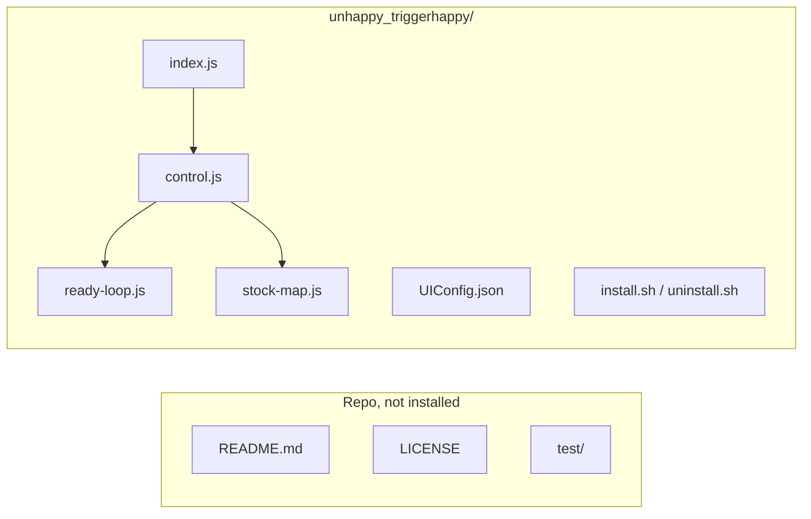
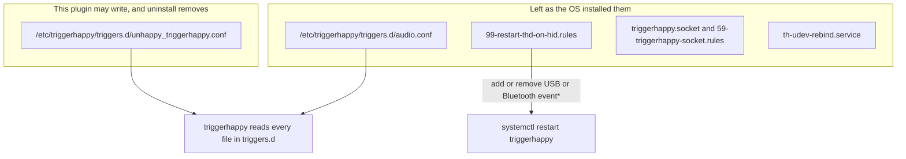
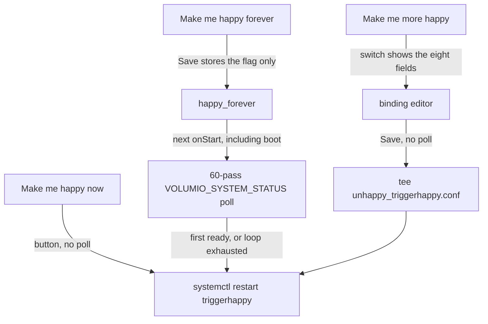
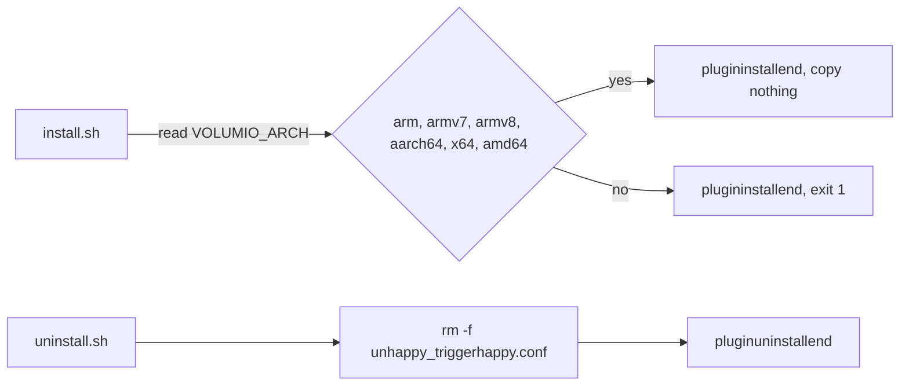
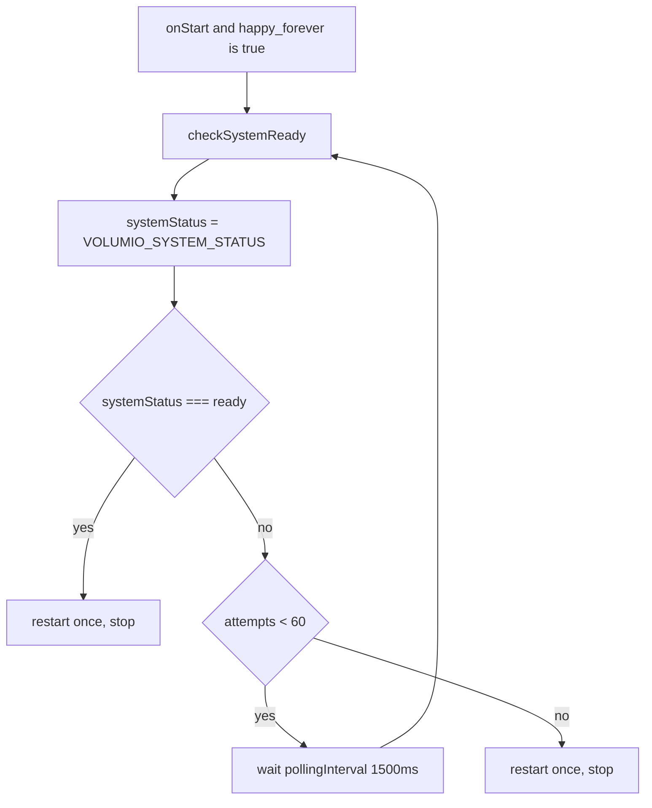

# Unhappy TriggerHappy

Volumio 4 / Bookworm system-controller plugin. Author string `Just a Nerd`. Pretty name `Unhappy TriggerHappy`. Package name `unhappy_triggerhappy`. License MIT, same file as the repo root.

The installed payload is the `unhappy_triggerhappy/` directory. This README stays in the repo. `volumio plugin package` zips every file under the directory it is run from (`pluginhelper.js` `find -type f`), so package from `unhappy_triggerhappy/` and the repo docs are not in the zip.



## What it covers

The plugin covers two triggerhappy gaps the OS tree is not changing.

1. On the Volumio 4 installs where each triggerhappy command runs twice per press, restarting `triggerhappy` after Volumio has finished loading makes the next presses run once, until the next time the service starts. This plugin does that restart. It does not change volumio-os.
2. A binding editor can rewrite this plugin's own triggers file. The stock baseline is the hanger `audio.conf` command list, through `/usr/local/bin/volumio`.

The plugin does not decide why one `thd` process runs a command twice. It restarts the service the same way the udev rule and the forum reports already restart it.

## What the plugin does not do



- It does not edit, replace, or delete `/etc/triggerhappy/triggers.d/audio.conf`.
- It does not disable, mask, or edit `99-restart-thd-on-hid.rules`. That rule still runs `/bin/systemctl restart triggerhappy` when a USB or Bluetooth input `event*` node is added or removed. A later udev restart can bring the double-fire back. This plugin does not hook that rule and does not start another poll when it fires.
- It does not mask `triggerhappy.socket`, does not touch `59-triggerhappy-socket.rules`, and does not change `th-udev-rebind.service`.
- It does not enable, disable, or stop `triggerhappy` except for `restart`.
- It does not install a systemd unit, a sudoers file, or a udev rule.
- It does not use the Allo relay attenuator's fixed 2 second timer, and it does not hold plugin start until ready. `onStart` returns as soon as the poll is scheduled.
- It does not ship a playlist binding or the forum `curl` to `playplaylist`. See below.
- It does not add seek, repeat, or the other lines people pasted on the forum. The editor is the eight hanger lines.

## Controls

Labels in the UI are exactly these strings.



**Make me happy now.** Button. Runs `/usr/bin/sudo /bin/systemctl restart triggerhappy` once. No poll. The unit in volumio-os is `triggerhappy.service` (`ExecStart=/usr/sbin/thd --triggers /etc/triggerhappy/triggers.d/ ...`). The udev rule restarts it as `triggerhappy`. `systemctl` is already NOPASSWD for the `volumio` user.

**Make me happy forever.** Switch. Saving the switch only stores the flag. It does not poll and does not restart. Turning it off cancels a poll that this process already started. The poll runs from `onStart` when the flag is true. Volumio calls `onStart` when the enabled plugin starts, including at boot. That is the boot path. There is no second unit.

**Make me more happy.** Switch on the binding section. Turning it on shows the eight command fields (`visibleIf`). Save writes `/etc/triggerhappy/triggers.d/unhappy_triggerhappy.conf` and restarts `triggerhappy` immediately. No poll.

The event value written for every line is `1`, matching hanger `audio.conf`. The editor does not change the key name or the event value. Clearing a command omits that line from the plugin file. A command that contains a newline is rejected and nothing is restarted.

`/usr/bin/tee` is already NOPASSWD, so Save does not add a sudoers file. `audio.conf` is still loaded from the same triggers directory. The same key in both files runs both commands. Saving the stock map on top of an untouched `audio.conf` double-fires those keys even after a restart. The plugin file is for a map that is not already the stock file. Uninstall deletes only the plugin file.

## Install and uninstall



`install.sh` reads `VOLUMIO_ARCH` from `/etc/os-release` the way Audio Keepalive does:

```sh
ARCH=$(cat /etc/os-release | grep ^VOLUMIO_ARCH | tr -d 'VOLUMIO_ARCH="')
```

Empty arch fails. Accepted values are `arm`, `armv7`, `armv8`, `aarch64`, `x64`, and `amd64`. Anything else fails. Both failures print `plugininstallend` and exit 1, which is how that install script reports an unsupported arch. Success prints `plugininstallend` and copies nothing.

`package.json` lists store architectures `amd64` and `armhf`. Those are the dpkg architectures `pluginhelper.js` accepts. `VOLUMIO_ARCH` is a different string (`arm` / `armv7` map to the armhf payload family; `x64` / `amd64` map to amd64). This plugin has no per-arch binaries, so the check only accepts or refuses. It does not look for a `bin/$ARCH` directory.

`uninstall.sh` runs `rm -f /etc/triggerhappy/triggers.d/unhappy_triggerhappy.conf` and prints `pluginuninstallend`. It does not remove `audio.conf` or the udev rule.

## Ready loop

Copied from `es9018k2m_dac/index.js`, `applyStartupVolume` / `checkSystemReady`. Not from AutoStart (that interval is a config value, default 5000) and not from Allo.



- `pollingInterval = 1500`
- `maxAttempts = 60`
- `attempts`
- `systemStatus = process.env.VOLUMIO_SYSTEM_STATUS`
- `systemStatus === 'ready'` restarts and does not schedule another pass
- `attempts < maxAttempts` schedules `setTimeout(checkSystemReady, pollingInterval)`
- otherwise restarts once

The first pass runs immediately. A miss waits 1500ms. Sixty passes with no `ready` are fifty-nine waits, then one restart. There is no restart before the loop ends, and no second restart after it.

`onStop` cancels a pending timeout so a disable during the wait does not restart later.

## Playlist

`volumio3-backend` `app/plugins/system_controller/volumio_command_line_client/volumio.sh` has no `playlist`, `playplaylist`, or `playPlaylist` verb. The verbs that match the hanger file are `volume toggle`, `volume plus`, `volume minus`, `stop`, `play`, `toggle`, `next`, and `previous`.

`app/plugins/user_interface/rest_api/playback.js` does handle HTTP `cmd=playplaylist`. That is the REST API, not the CLI. The forum `curl` to that URL is not in the editor and not in the rendered map.

## Payload

Shipped, same shape as a small system controller: `package.json`, `index.js`, `install.sh`, `uninstall.sh`, `UIConfig.json`, `config.json`, `i18n/strings_en.json`, plus `ready-loop.js`, `stock-map.js`, and `control.js` so the poll and the map can be required without Volumio. English strings only. `kew`, `fs-extra`, and `v-conf` are declared and not bundled. `install.sh` does not run `npm install`.

Not shipped: this README, `test/`, and `LICENSE`. `package.json` `license` is `MIT`, matching that root file.

## Tests

From the repo root:

```sh
node --test test/ready-loop.test.js test/stock-map.test.js test/control.test.js
```

The poll tests use Node's mocked timers. No device, no `systemctl`, no triggerhappy process. A green run is not a Volumio boot.
