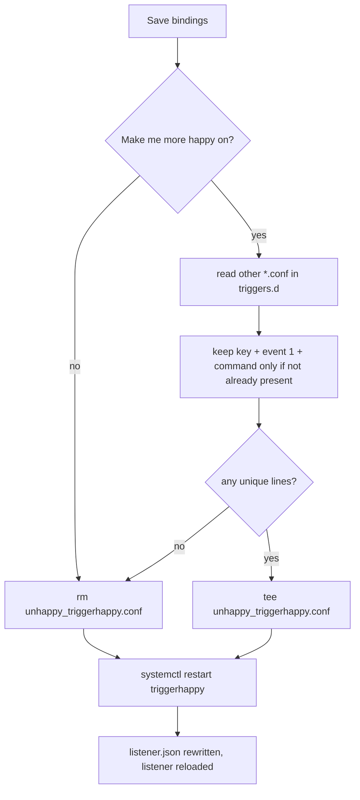
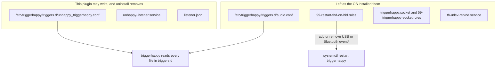
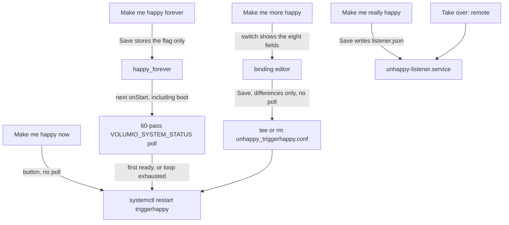
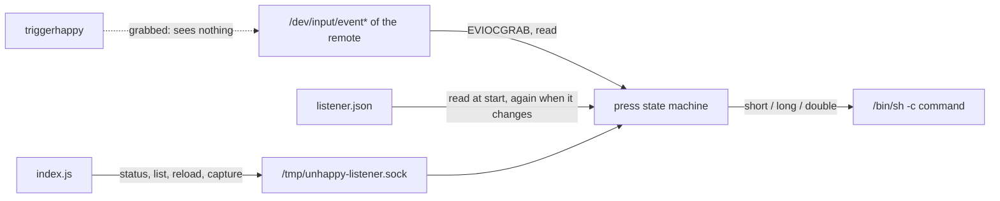
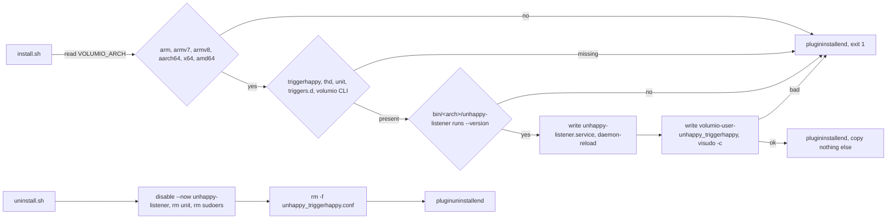
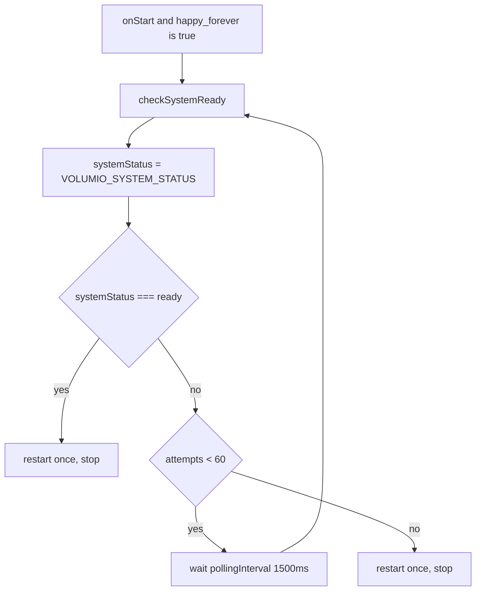

# Unhappy TriggerHappy

Volumio 4 / Bookworm system-controller plugin. Author string `Just a Nerd`. Pretty name `Unhappy TriggerHappy`. Package name `unhappy_triggerhappy`. License MIT, same file as the repo root.

The installed payload is the `unhappy_triggerhappy/` directory plus, in a release zip, the listener binary for every Volumio architecture under `bin/<arch>/`. The zip a player installs is built by the release train and published on GitHub; see Building and releasing.

```mermaid
flowchart LR
  subgraph repo ["Repo, not installed"]
    README["README.md"]
    LICENSE["LICENSE"]
    TEST["test/"]
    SRC["bins/unhappy-listener/ (Rust)"]
  end
  subgraph payload ["unhappy_triggerhappy/"]
    IDX["index.js"]
    CTRL["control.js"]
    LOOP["ready-loop.js"]
    MAP["stock-map.js"]
    LST["listener.js, devices.js, listener-client.js"]
    UI["UIConfig.json"]
    SH["install.sh / uninstall.sh"]
    BIN["bin/&lt;arch&gt;/unhappy-listener"]
  end
  IDX --> CTRL
  CTRL --> LOOP
  CTRL --> MAP
  IDX --> LST
  SRC -. ship.sh .-> BIN
```

## What it covers

The plugin covers three triggerhappy gaps the OS tree is not changing.

1. On the Volumio 4 installs where each triggerhappy command runs twice per press, restarting `triggerhappy` after Volumio has finished loading makes the next presses run once, until the next time the service starts. This plugin does that restart. It does not change volumio-os.
2. A binding editor can write this plugin's own triggers file. The stock baseline is the hanger `audio.conf` command list, through `/usr/local/bin/volumio`. The plugin file is differences only. It must not become a second copy of the stock map.
3. Triggerhappy knows a press, a release, and the kernel's autorepeat, and nothing else. For a remote you take over, the plugin's own listener reads the keys instead and tells a short press from a long one and a double one, with a debounce window.

The double fire has one cause on these images: `th-udev-rebind.service` runs after `triggerhappy.service` and adds every `/dev/input/event*` to the daemon over its socket, although the daemon opened them all itself through its device glob. Each device is then read twice until a restart, which opens them once.

## Binding write (differences only)

Triggerhappy loads every `*.conf` in `triggers.d`. Writing the stock map into `unhappy_triggerhappy.conf` while `audio.conf` still has the same keys runs both. The same `KEY_PLAYPAUSE` line in both files fires twice.


```mermaid
flowchart TD
  SAVE["Save bindings"] --> MORE{"Make me more happy on?"}
  MORE -->|no| RM["rm unhappy_triggerhappy.conf"]
  MORE -->|yes| READ["read other *.conf in triggers.d"]
  READ --> DIFF["keep key + event 1 + command only if not already present"]
  DIFF --> ANY{"any unique lines?"}
  ANY -->|no| RM
  ANY -->|yes| WRITE["tee unhappy_triggerhappy.conf"]
  RM --> RESTART["systemctl restart triggerhappy"]
  WRITE --> RESTART
  RESTART --> SYNC["listener.json rewritten, listener reloaded"]
```

Rules:

- Before Save, read live `*.conf` files in `/etc/triggerhappy/triggers.d/` that this plugin did not write. Do not invent a second stock copy.
- A line is a duplicate when `KEY`, event value `1`, and the normalized command already appear in those foreign files. Identical stock lines must not appear in `unhappy_triggerhappy.conf`.
- A Save that would write only duplicates writes nothing and removes `unhappy_triggerhappy.conf` if it exists.
- Turning **Make me more happy** off removes the plugin conf and restarts once.
- Forever and Now never write the plugin conf.
- The same Save rewrites the listener's file when the listener is on: one map, two executors.

## What the plugin does not do


```mermaid
flowchart TB
  subgraph left ["Left as the OS installed them"]
    AUDIO["/etc/triggerhappy/triggers.d/audio.conf"]
    UDEV["99-restart-thd-on-hid.rules"]
    SOCK["triggerhappy.socket and 59-triggerhappy-socket.rules"]
    REBIND["th-udev-rebind.service"]
  end
  subgraph owned ["This plugin may write, and uninstall removes"]
    OWN["/etc/triggerhappy/triggers.d/unhappy_triggerhappy.conf"]
    UNIT["unhappy-listener.service"]
    CONF["listener.json"]
  end
  THD["triggerhappy reads every file in triggers.d"]
  AUDIO --> THD
  OWN --> THD
  UDEV -->|"add or remove USB or Bluetooth event*"| RESTART["systemctl restart triggerhappy"]
```

- It does not edit, replace, or delete `/etc/triggerhappy/triggers.d/audio.conf`.
- It does not disable, mask, or edit `99-restart-thd-on-hid.rules`. That rule still runs `/bin/systemctl restart triggerhappy` when a USB or Bluetooth input `event*` node is added or removed. This plugin does not hook that rule and does not start another poll when it fires.
- It does not mask `triggerhappy.socket`, does not touch `59-triggerhappy-socket.rules`, and does not change `th-udev-rebind.service`.
- It does not enable, disable, or stop `triggerhappy` except for `restart`. A remote taken over by the listener is grabbed; triggerhappy keeps running and keeps every other device.
- It does not install a udev rule. It installs one systemd unit, the listener's, and one sudoers file naming the exact commands it runs, and removes both on uninstall.
- It does not use the Allo relay attenuator's fixed 2 second timer, and it does not hold plugin start until ready. `onStart` returns as soon as the poll is scheduled.
- It does not ship a playlist binding or the forum `curl` to `playplaylist`. See below.
- It does not add seek, repeat, or the other lines people pasted on the forum. The editor is the eight hanger lines.

## Controls

Labels in the UI are exactly these strings.


```mermaid
flowchart TD
  NOW["Make me happy now"] -->|"button, no poll"| RESTART["systemctl restart triggerhappy"]
  FOREVER["Make me happy forever"] -->|"Save stores the flag only"| FLAG["happy_forever"]
  FLAG -->|"next onStart, including boot"| POLL["60-pass VOLUMIO_SYSTEM_STATUS poll"]
  POLL -->|"first ready, or loop exhausted"| RESTART
  MORE["Make me more happy"] -->|"switch shows the eight fields"| EDITOR["binding editor"]
  EDITOR -->|"Save, differences only, no poll"| WRITE["tee or rm unhappy_triggerhappy.conf"]
  WRITE --> RESTART
  REALLY["Make me really happy"] -->|"Save writes listener.json"| LISTENER["unhappy-listener.service"]
  TAKE["Take over: remote"] --> LISTENER
```

**Make me happy now.** Button. Runs `/usr/bin/sudo /bin/systemctl restart triggerhappy` once. No poll. Does not write or remove the plugin conf. The unit in volumio-os is `triggerhappy.service` (`ExecStart=/usr/sbin/thd --triggers /etc/triggerhappy/triggers.d/ ...`). The udev rule restarts it as `triggerhappy`. The restart is one line of the plugin's sudoers file.

**Make me happy forever.** Switch. Saving the switch only stores the flag. It does not poll, does not restart, and does not write the plugin conf. Turning it off cancels a poll that this process already started. The poll runs from `onStart` when the flag is true. Volumio calls `onStart` when the enabled plugin starts, including at boot. That is the boot path. There is no second unit for it.

**Make me more happy.** Switch on the binding section. Turning it on shows the eight command fields (`visibleIf`). Save compares the UI map to foreign `*.conf` files, writes only differing lines to `/etc/triggerhappy/triggers.d/unhappy_triggerhappy.conf`, or removes that file when there are no differences or when the switch is off, then restarts `triggerhappy` immediately. No poll.

The event value written for every line is `1`, matching hanger `audio.conf`. The editor does not change the key name or the event value. Clearing a command omits that line from the plugin file. A command that contains a newline is rejected and nothing is restarted.

`/usr/bin/tee` and `/bin/rm -f` on the plugin's file are lines of the plugin's sudoers file. Uninstall deletes only the plugin file.

**Make me really happy.** Switch on the listener section, with the three timings and one **Take over** switch per remote. A remote is every input node of one name: a USB receiver that presents a keyboard and a consumer-control node is one remote. The list shows the key devices present, without touchscreens, and any remote taken over earlier that is not connected now. Save writes `listener.json`, and starts or stops the listener. The status line names what the listener holds.

## The listener

`unhappy-listener` is a daemon in the plugin's zip, one static binary per Volumio architecture, written in Rust. It grabs the remotes named in its configuration exclusively, reads their keys with the kernel's timestamps, and runs a command on a short, long, or double press. Everything else on the player keeps its input devices: a device is grabbed only when the configuration names it, and triggerhappy keeps serving the rest.


```mermaid
flowchart LR
  REMOTE["/dev/input/event* of the remote"] -->|"EVIOCGRAB, read"| ENGINE["press state machine"]
  ENGINE -->|"short / long / double"| SH["/bin/sh -c command"]
  CONF["listener.json"] -->|"read at start, again when it changes"| ENGINE
  PLUGIN["index.js"] -->|"status, list, reload, capture"| SOCK["/tmp/unhappy-listener.sock"]
  SOCK --> ENGINE
  THD["triggerhappy"] -.->|"grabbed: sees nothing"| REMOTE
```

**Presses.** Per key on each device:

- A press closer than the debounce window to the previous press is contact bounce and counts once.
- Autorepeat events are ignored; the clock decides what is long.
- A key held for the long threshold fires its long binding once, and the release that follows fires nothing.
- With a double binding on the key, a release starts the double gap: a second press inside it fires the double binding at once, and the release of that press fires nothing; a gap that runs out fires the short binding, if any.
- Without a double binding, a release before the long threshold fires the short binding at once.

Defaults: long 400 ms, double gap 300 ms, debounce 30 ms. The listener refuses a configuration with long outside 100 to 5000 ms, double outside 50 to 2000 ms, or debounce above 500 ms, and keeps the one it had.

**Configuration.** `/data/configuration/system_controller/unhappy_triggerhappy/listener.json`, written by the plugin:

```json
{
  "devices": [ { "name": "2.4G Composite Devic", "phys": "", "uniq": "" } ],
  "timing": { "long_ms": 400, "double_ms": 300, "debounce_ms": 30 },
  "bindings": [
    { "key": "KEY_PLAYPAUSE", "press": "short", "command": "/usr/local/bin/volumio toggle" }
  ]
}
```

A device is matched by name; `phys` and `uniq`, when not empty, must match too. Key names are the kernel's (`KEY_PLAYPAUSE`, `KEY_VOLUMEUP`, and so on); an unknown name or an empty or multi-line command refuses the whole file. The daemon looks at the file once a second and reloads when it changed. Devices named but absent are picked up when they appear; a device that goes away is dropped and looked for again.

**Commands** run as the volumio user through `/bin/sh -c`, detached; the daemon neither waits for them nor reads their output. Each run is logged with its key and press.

**Control socket.** `/tmp/unhappy-listener.sock`: one JSON object in, one JSON line back, then the connection closes.

| Request | Answer |
| --- | --- |
| `{"cmd":"status"}` | `ok`, `version`, `config`, `config_error`, the `devices` held, `wanted`, `bindings`, `timing`, `capturing` |
| `{"cmd":"list"}` | every input device with keys: `name`, `phys`, `uniq`, `path`, `keys`, `touch`, `taken` |
| `{"cmd":"reload"}` | the configuration read again: `ok`, or `error` |
| `{"cmd":"capture","timeout_ms":10000}` | the next key pressed on any device: `key` and `device`, or `error: timeout`. While a capture waits, presses run no commands |

**Unit.** `unhappy-listener.service`, written by `install.sh` with the binary for the machine's architecture, run as `volumio` with the `input` group as a supplementary group, restarted on failure. The plugin enables and starts it when the listener is on, and disables and stops it when the listener is off or the plugin is stopped. Its log is the journal: `journalctl -u unhappy-listener`.

## Install and uninstall


```mermaid
flowchart LR
  INSTALL["install.sh"] -->|"read VOLUMIO_ARCH"| ARCH{"arm, armv7, armv8, aarch64, x64, amd64"}
  ARCH -->|no| FAIL["plugininstallend, exit 1"]
  ARCH -->|yes| DEPS{"triggerhappy, thd, unit, triggers.d, volumio CLI"}
  DEPS -->|missing| FAIL
  DEPS -->|present| BIN{"bin/&lt;arch&gt;/unhappy-listener runs --version"}
  BIN -->|no| FAIL
  BIN -->|yes| UNIT["write unhappy-listener.service, daemon-reload"]
  UNIT --> SUDO["write volumio-user-unhappy_triggerhappy, visudo -c"]
  SUDO -->|bad| FAIL
  SUDO -->|ok| ENDI["plugininstallend, copy nothing else"]
  UNINSTALL["uninstall.sh"] --> STOP["disable --now unhappy-listener, rm unit, rm sudoers"]
  STOP --> RM["rm -f unhappy_triggerhappy.conf"]
  RM --> ENDU["pluginuninstallend"]
```

Volumio runs `install.sh` as root through `sudo sh`, so the script is POSIX sh and uses no bash syntax.

`install.sh` reads `VOLUMIO_ARCH` from `/etc/os-release` the way Audio Keepalive does:

```sh
ARCH=$(cat /etc/os-release | grep ^VOLUMIO_ARCH | tr -d 'VOLUMIO_ARCH="')
```

Empty arch fails. Accepted values are `arm`, `armv7`, `armv8`, `aarch64`, `x64`, and `amd64`; `aarch64` takes the `armv8` binary and `amd64` the `x64` one. Anything else fails. Every failure prints `plugininstallend` and exits 1, which is how that install script reports an unsupported arch. Success writes the listener's unit and the plugin's sudoers file and copies nothing else.

The listener binary is run once with `--version` during install, so a zip without a binary for the machine, or with one that cannot run on it, fails the install rather than the first key press.

The sudoers file, `/etc/sudoers.d/volumio-user-unhappy_triggerhappy`, names the exact commands the plugin runs as the `volumio` user and nothing wider: the triggerhappy restart, the listener unit's enable, disable, start, stop, and restart, `tee` and `rm -f` on the plugin's conf, each in its `/bin` and `/usr/bin` spelling. It is written with mode 0440 and checked with `visudo -c -f`; a file that does not check is removed and the install fails.

### Dependencies

Everything the plugin needs is already part of a Volumio 4 image. `install.sh` checks each hard dependency and fails when one is missing. It does not run `apt`.

| Dependency | Used for | Provided by | Check |
| --- | --- | --- | --- |
| `triggerhappy` package, `/usr/sbin/thd` | the daemon that is restarted | Volumio base package list | `dpkg-query` status and `-x` |
| `triggerhappy.service` | `systemctl restart triggerhappy` | `volumio-os` unit file | `systemctl cat` |
| `/etc/triggerhappy/triggers.d/` with `audio.conf` | foreign conf reads, the plugin conf | package directory, `audio.conf` from `volumio-os` | `-d` |
| `/usr/local/bin/volumio` | every binding command | `volumio-os` symlink to the backend CLI | `-x` |
| `sudo` with the plugin's rules for `volumio` | restart, write, remove, the listener's unit | `/etc/sudoers.d/volumio-user-unhappy_triggerhappy`, written by `install.sh` | `visudo -c -f` |
| `/dev/input/event*` readable by the `input` group | the listener's devices | the kernel and udev; the unit's `SupplementaryGroups=input` | `--version` run of the binary |
| `kew`, `fs-extra`, `v-conf` | plugin runtime | the Volumio plugin installer | not checked |

The listener itself needs nothing from the player: it is linked statically against musl, with no C library, Python, or Node dependency.

### Updating

The backend keeps a plugin's code loaded until it restarts. After an update from the store or from `get-unhappy.sh`, restart Volumio (`volumio vrestart`, or a reboot) before judging the result; the installer script does this itself.

### From a release

On the player, as the volumio user:

```sh
curl -fsSL https://raw.githubusercontent.com/foonerd/unhappy/main/get-unhappy.sh | sh
```

It downloads the latest release's zip from GitHub, checks it against the release's `SHA256SUMS`, hands it to the plugin manager over the player's socket, enables a fresh install, and restarts the backend after an update. A version on the command line (`sh -s -- 1.1.0`) takes that release instead.

## Ready loop

Copied from `es9018k2m_dac/index.js`, `applyStartupVolume` / `checkSystemReady`. Not from AutoStart (that interval is a config value, default 5000) and not from Allo.


```mermaid
flowchart TD
  START["onStart and happy_forever is true"] --> CHECK["checkSystemReady"]
  CHECK --> READ["systemStatus = VOLUMIO_SYSTEM_STATUS"]
  READ --> READY{"systemStatus === ready"}
  READY -->|yes| ONCE["restart once, stop"]
  READY -->|no| LEFT{"attempts < 60"}
  LEFT -->|yes| WAIT["wait pollingInterval 1500ms"]
  WAIT --> CHECK
  LEFT -->|no| ANYWAY["restart once, stop"]
```

- `pollingInterval = 1500`
- `maxAttempts = 60`
- `attempts`
- `systemStatus = process.env.VOLUMIO_SYSTEM_STATUS`
- `systemStatus === 'ready'` restarts and does not schedule another pass
- `attempts < maxAttempts` schedules `setTimeout(checkSystemReady, pollingInterval)`
- otherwise restarts once

The first pass runs immediately. A miss waits 1500ms. Sixty passes with no `ready` are fifty-nine waits, then one restart. There is no restart before the loop ends, and no second restart after it.

`onStop` cancels a pending timeout so a disable during the wait does not restart later.

## Playlist

`volumio3-backend` `app/plugins/system_controller/volumio_command_line_client/volumio.sh` has no `playlist`, `playplaylist`, or `playPlaylist` verb. The verbs that match the hanger file are `volume toggle`, `volume plus`, `volume minus`, `stop`, `play`, `toggle`, `next`, and `previous`.

`app/plugins/user_interface/rest_api/playback.js` does handle HTTP `cmd=playplaylist`. That is the REST API, not the CLI. The forum `curl` to that URL is not in the editor and not in the rendered map.

## Payload

Shipped, same shape as a small system controller: `package.json`, `index.js`, `install.sh`, `uninstall.sh`, `UIConfig.json`, `config.json`, `i18n/strings_en.json`, plus `ready-loop.js`, `stock-map.js`, `control.js`, `listener.js`, `devices.js`, and `listener-client.js`, so the poll, the map, and the listener's configuration can be required without Volumio. English strings only. `kew`, `fs-extra`, and `v-conf` are declared and installed by the Volumio plugin installer. `install.sh` does not run `npm install`.

A release zip adds `bin/<arch>/unhappy-listener` for `arm`, `armv7`, `armv8`, and `x64`, and `build.json` naming the commit and time it was built from.

Not shipped: this README, `test/`, `bins/`, `scripts/`, and `LICENSE`. `package.json` `license` is `MIT`, matching that root file.

## Building and releasing

The listener is built on a developer's machine or in CI, never on a player.

- `scripts/check.sh`: formatting, clippy with warnings denied, the Rust tests, the documentation with warnings denied, the shell scripts parsed and linted, the plugin's JavaScript and JSON checked, and the Node tests. Nothing ships without it.
- `scripts/ship.sh`: the four static builds into `bin/<arch>/`. The `arm` binary is ARMv6 code for Volumio's universal Pi image; `armv7`, `armv8`, and `x64` are what their names say. The cross compilers only drive the link; the C runtime comes with the Rust musl targets. The script refuses a binary that is not static or whose `arm` build is not ARMv6.
- `scripts/package.sh`: the payload, the four binaries, and the node modules as `dist/unhappy_triggerhappy-<version>.zip`, the plugin's version taken from `Cargo.toml`.
- `scripts/release-notes.sh`: the changelog section of a version, for the release notes.

CI (`.github/workflows/ci.yml`) runs the check and the builds on every push and pull request in Glass's builder image. A tag `v<version>` (`.github/workflows/release.yml`) runs the same, checks that the tag, `Cargo.toml`, `package.json`, and `CHANGELOG.md` agree, and publishes the zip with its `SHA256SUMS` as a pre-release, the notes from the changelog with the sponsorship footer. It is made the latest by hand once it has been tried.

## Tests

From the repo root:

```sh
cargo test --workspace
node --test test/
```

The Rust tests drive the press state machine on a table of timings, the configuration parser, and the control socket. The Node tests cover the poll with mocked timers, the stock map and the differences-only write, the listener's configuration and device rows, and the sysfs device list against a stand-in tree. No device, no `systemctl`, no triggerhappy process. A green run is not a Volumio boot.
